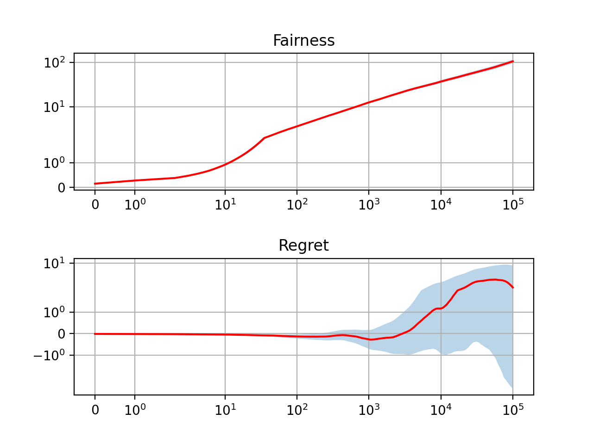
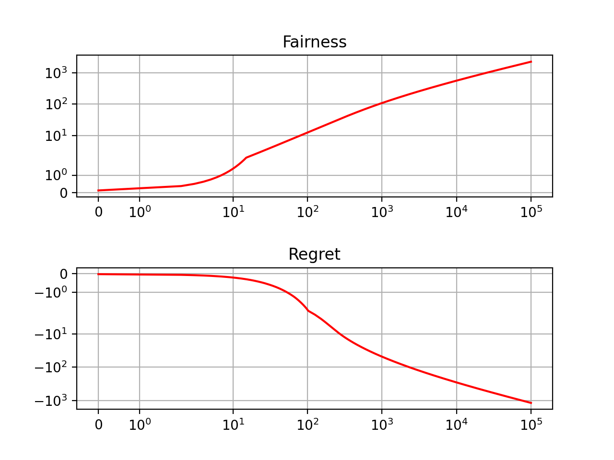
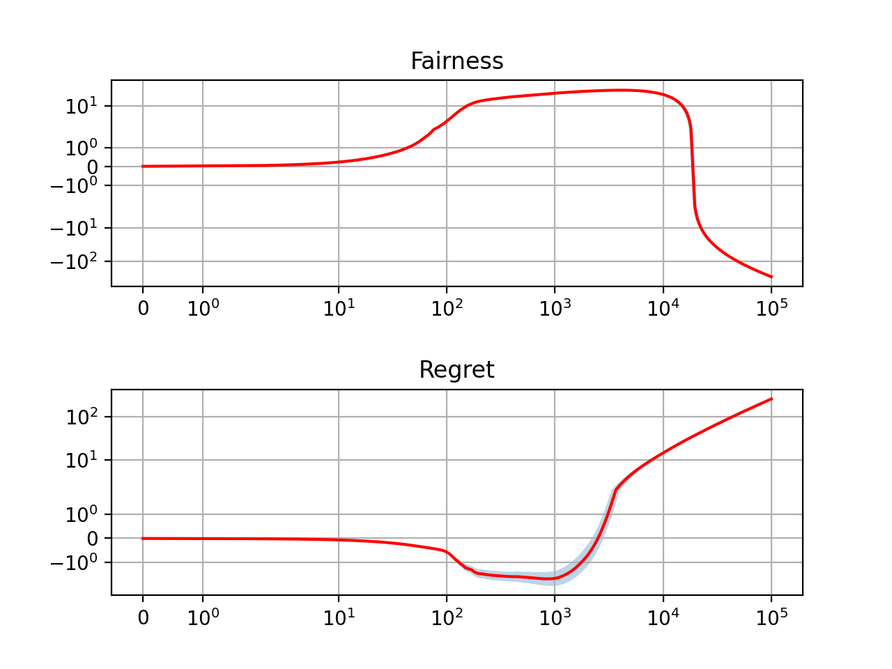

# Fair bandits

## Install
All commands are to be run from the unzipped directory unless specified otherwise.

### Create virtual environment
``` python
conda create --name fairbandit pip
conda activate fairbandit
```

### Requirements
``` bash
pip install -r requirements.txt
```

For the core algorithm
* numpy

For plotting and running experiments
* matplotlib
* joblib

For running tests
* pytest

### Install fairbandits
``` bash
pip install -e .
```

Run tests
``` bash
pytest
```


## Experiments

Run `bash run_mmab.bash`

Move into the `figure` directory to see the reproduced figure:

Greedy algorithm



UCB algorithm



LCB algorithm

